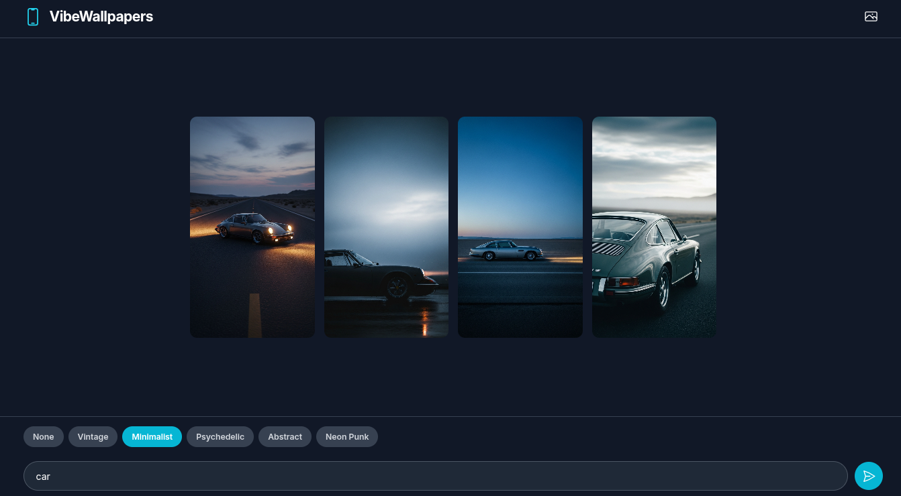
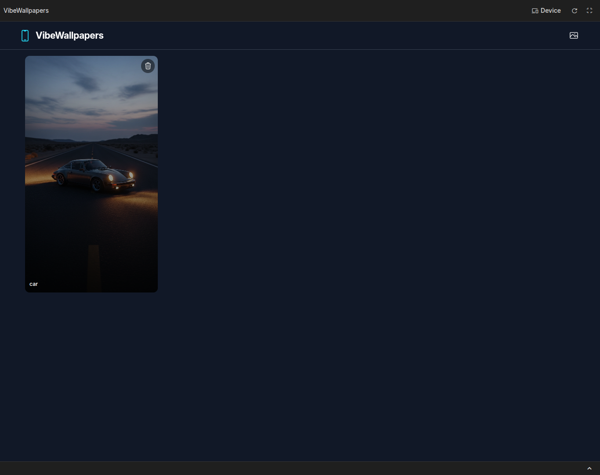

# Vibe Wallpapers

A modern web application for generating AI-powered phone wallpapers using Google's Gemini API. Create stunning, personalized wallpapers with various styles and themes.

## Features

- Generate custom phone wallpapers (9:16 aspect ratio)
- Apply different artistic styles and filters
- High-quality image generation with Gemini AI
- Responsive gallery view
- Modal image viewer

## Technologies Used

- **Frontend:** React, TypeScript, Vite
- **Backend:** Node.js, Express
- **AI Service:** Google Gemini API (Imagen model)
- **Styling:** CSS (with modern UI components)

## Prerequisites

- Node.js (version 16 or higher)
- npm or yarn
- Google Gemini API key

## Installation

1. Clone the repository:
   ```bash
   git clone https://github.com/rutanshubhayani/VybeWallpaper.git
   cd vibewallpapers
   ```

2. Install dependencies:
   ```bash
   npm install
   ```

3. Set up environment variables:
   - Copy the `.env` file or create one if it doesn't exist
   - Add your Gemini API key:
     ```
     VITE_GEMINI_API_KEY=your_api_key_here
     ```
     **Note:** Image generation using Gemini's Imagen model may incur costs and require a paid subscription. Ensure your API key has the necessary permissions and billing enabled.

## Running the Application

1. Start the backend server:
   ```bash
   node server.js
   ```
   The server will run on http://localhost:3002

2. In a new terminal, start the frontend:
   ```bash
   npm run dev
   ```
   The app will be available at http://localhost:5173

## Usage

1. Open the app in your browser
2. Enter a description for your wallpaper
3. Optionally select a style filter
4. Click "Generate" to create wallpapers
5. View and download your generated images

## API Endpoints

- `POST /generate` - Generate wallpapers
  - Body: `{ "prompt": "description", "filter": "style" }`
  - Response: `{ "images": ["data:image/jpeg;base64,..."] }`

## Project Structure

```
vibewallpapers/
├── components/          # React components
├── services/            # API service functions
├── src/                 # Vite source files
├── server.js            # Express backend server
├── package.json         # Dependencies and scripts
├── vite.config.ts       # Vite configuration
└── tsconfig.json        # TypeScript configuration
```

## Contributing

1. Fork the repository
2. Create a feature branch
3. Make your changes
4. Submit a pull request

## License

This project is licensed under the MIT License.

## Screenshots

### Home Page

*The main interface where users can enter prompts and select filters to generate wallpapers.*

### Generated Images

*Example of AI-generated wallpapers displayed in the gallery view.*

### Gallery View

*Full gallery showing multiple generated wallpapers with modal viewer capability.*